# Backend Sequence Diagrams

## 1. 인증 흐름 (Authentication Flow)

### 1.1 회원가입 (Signup)

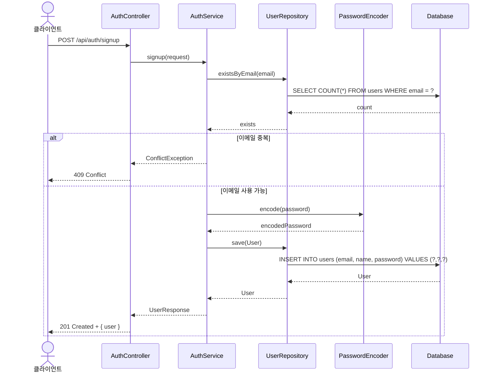

### 1.2 로그인 (Login)

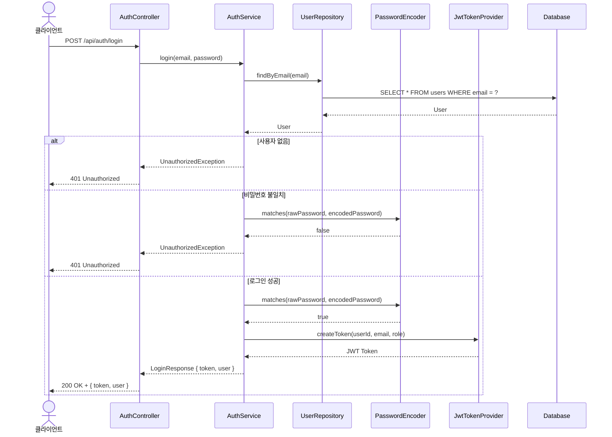

### 1.3 JWT 인증 필터 (JWT Authentication Filter)

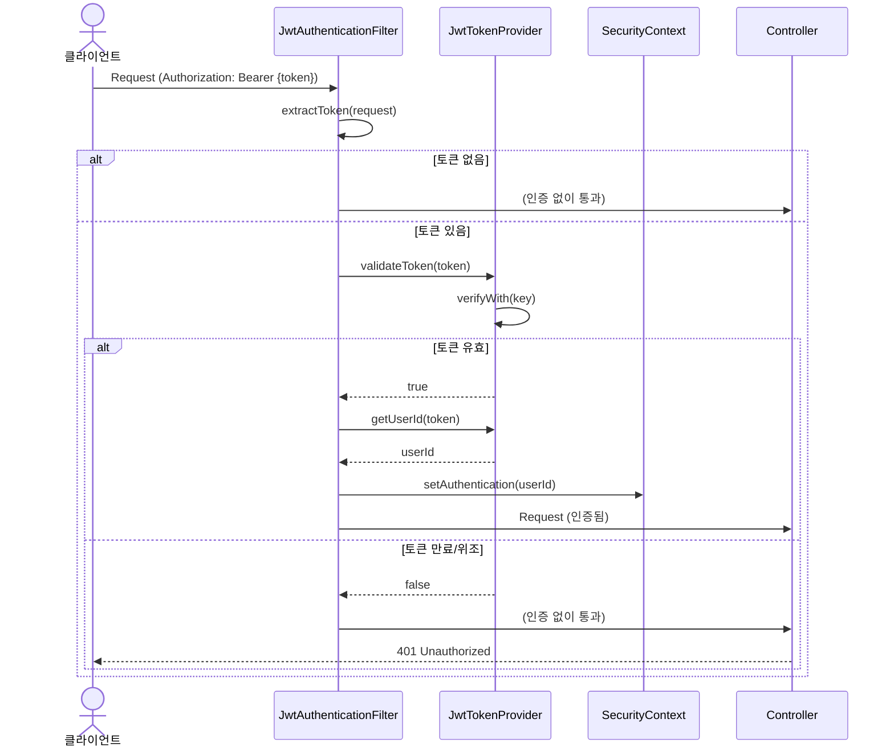

---

## 2. 수강 신청 흐름 (Enrollment Flow)

### 2.1 수강 신청 (Enroll in Course)

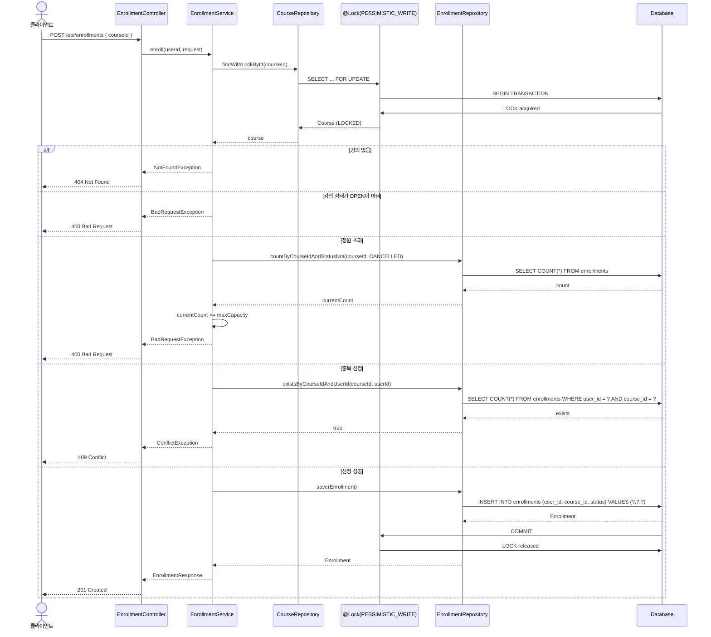

### 2.2 결제 확정 (Confirm Enrollment)

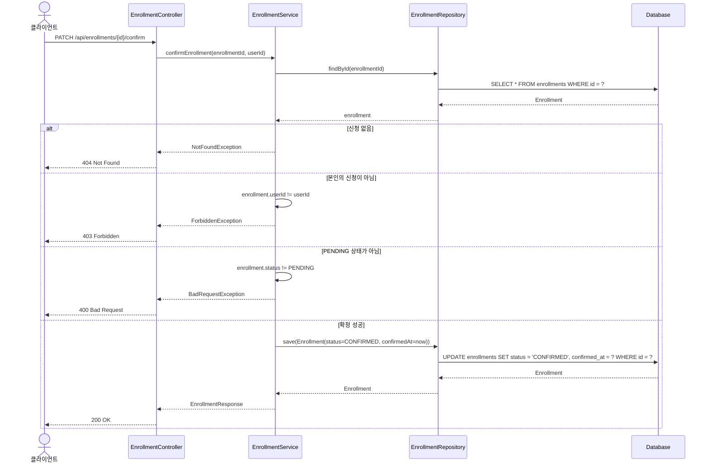

### 2.3 수강 취소 (Cancel Enrollment)

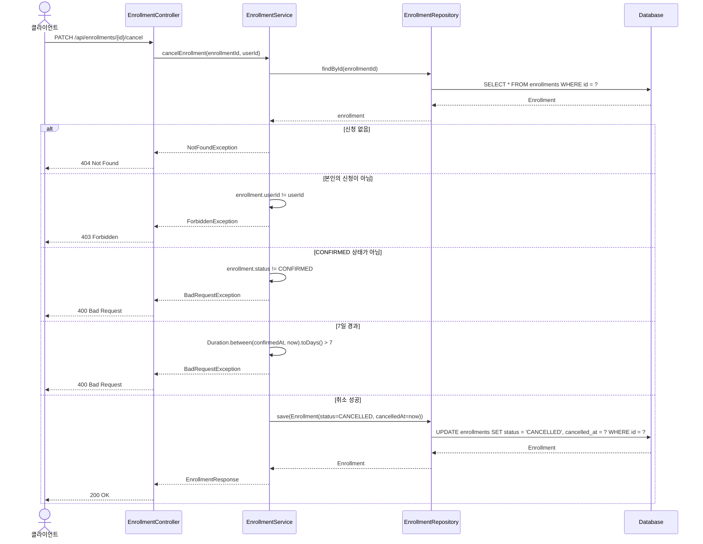

---

## 3. 강의 관리 흐름 (Course Management Flow)

### 3.1 강의 생성 (Create Course)

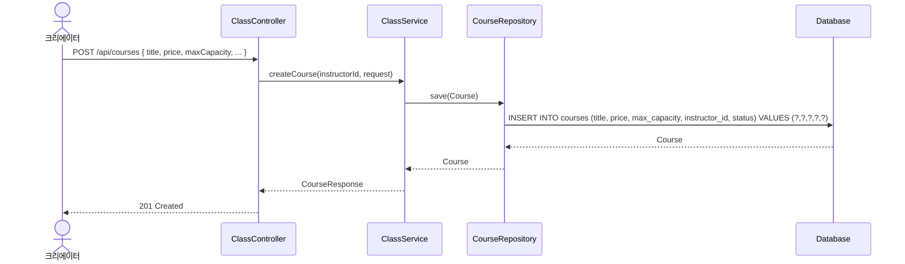

### 3.2 강의 상태 변경 (Change Course Status)

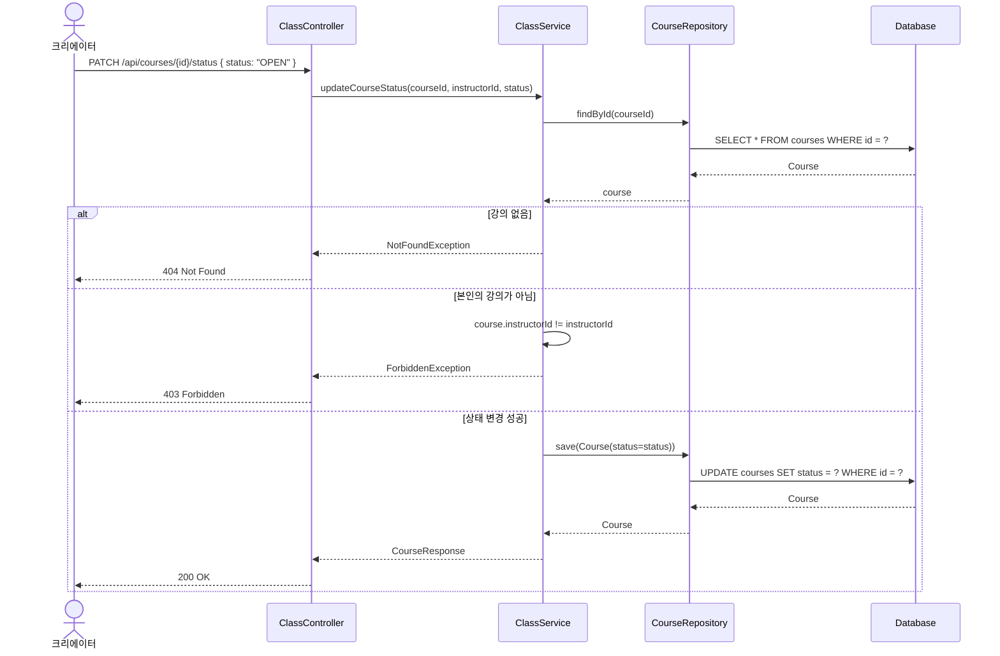

### 3.3 강의별 수강생 목록 (Get Course Enrollments)

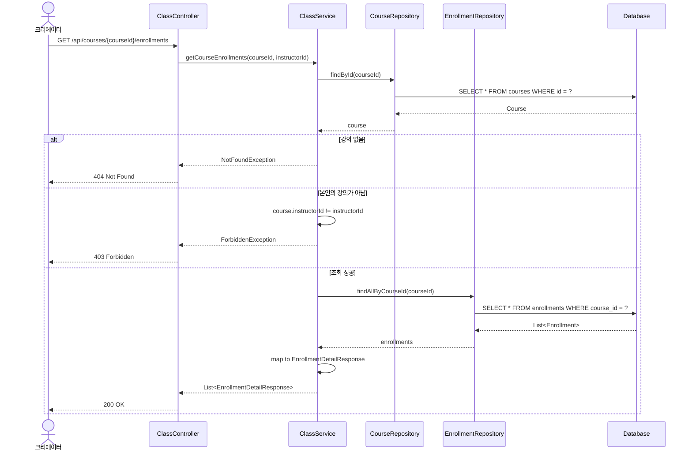

---

## 4. 동시성 제어 시나리오 (Concurrency Control)

### 4.1 정원 초과 방지 (Race Condition Prevention)

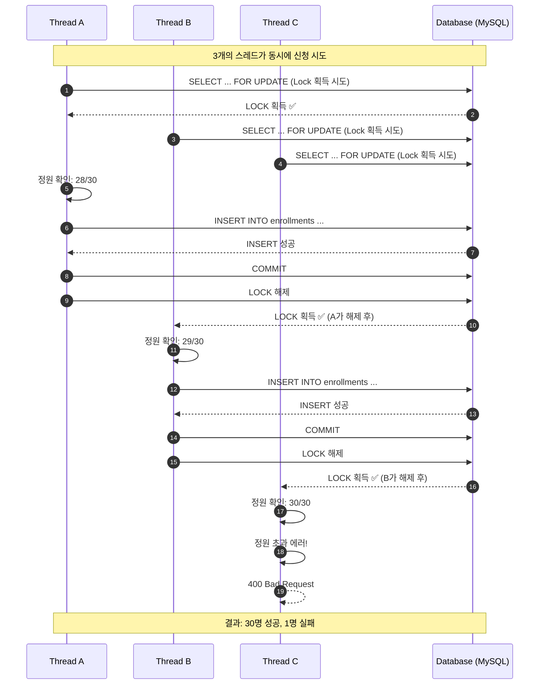

---

## 5. 에러 처리 흐름 (Error Handling)

### 5.1 전역 예외 처리 (Global Exception Handler)

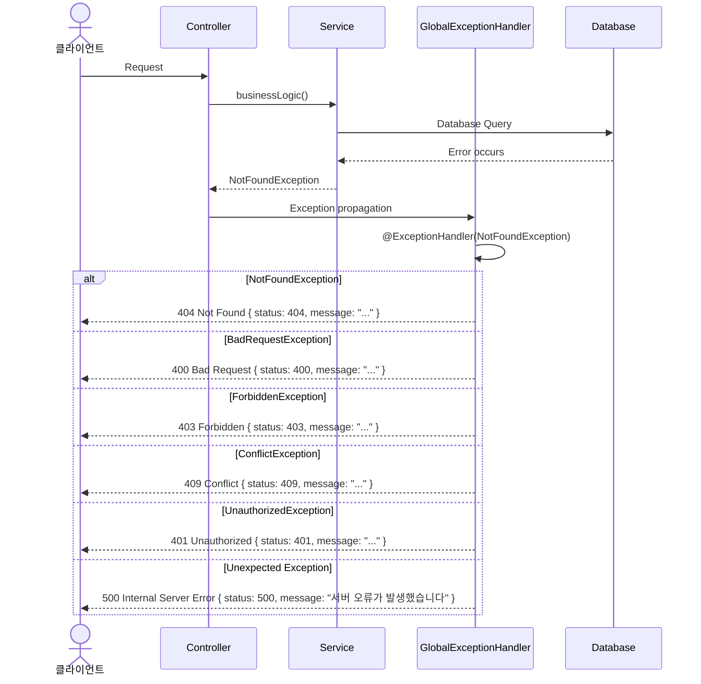

---

## 6. API 요청-응답 예시 (API Request-Response Examples)

### 6.1 정상 흐름 (Happy Path)

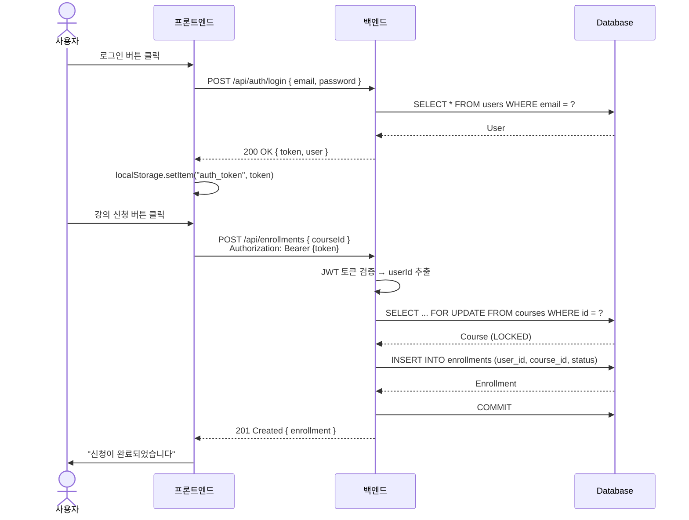

---

**문서 버전**: 1.0
**최종 수정**: 2026-04-26
